# Dokumentasi Audio Player
---
## Daftar Isi
* [Tampilan](#tampilan)
* [Blok](#blok)
    * [Ketika aplikasi dimuat](#ketika-aplikasi-dimuat)
    * [Kontrol Audio](#kontrol-audio)
    * [Penambahan Audio](#penambahan-audio)
    * [Pemilihan Playlist](#pemilihan-playlist)

---

## Tampilan

  
Tampilan setelah install  
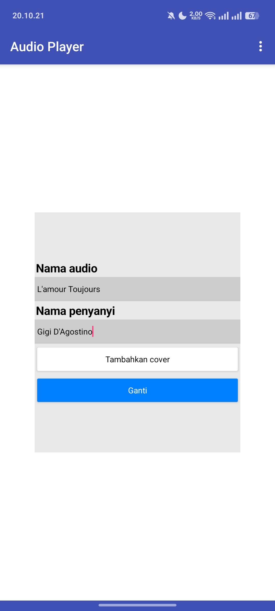  
Tampilan menambah file audio  
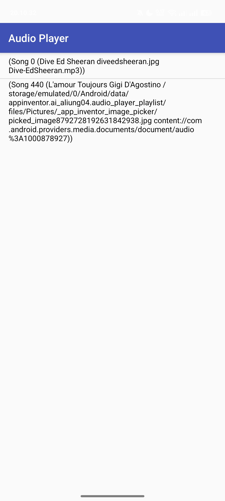  
Tampilan playlist  

---

## Blok

```bash
Screen1
├── MainScreen (Vertical Alignment)
│   ├── Cover (Image)
│   ├── TitleArtist (Horizontal Alignment)
│   │   ├── SongName (Label)
│   │   ├── dash (Label)
│   │   └── ArtistName (Label)
│   └── Control (Horizontal Alignment)
│       ├── Replay (Button)
│       ├── PlayPause (Button)
│       └── Loop (Button)
├── ChangeFile (Horizontal Alignment)
│   └── ContainerChangeAudio (Vertical Alignment)
│       ├── AudioNameLabel (Label)
│       ├── InputAudioName (TextBox)
│       ├── ArtistNameLabel (Label)
│       ├── InputArtistName (TextBox)
│       ├── InputCover (FilePicker)
│       └── Change (Button)
├── ChangeAudio (Horizontal Alignment)
│   ├── NewAudio (FilePicker)
│   ├── ReturnAudio (Button)
│   └── Playlist (ListPicker)
├── Player1 (Player)
├── Notif (Notifier)
└── Database (TinyDB)
```
Struktur blok User Interface

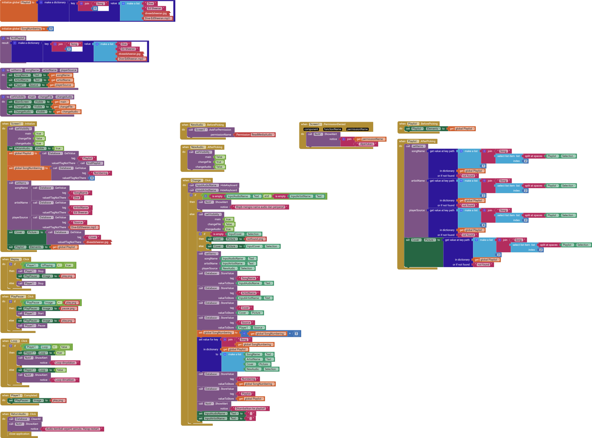
Tampilan semua blok kode.  

### Ketika aplikasi dimuat

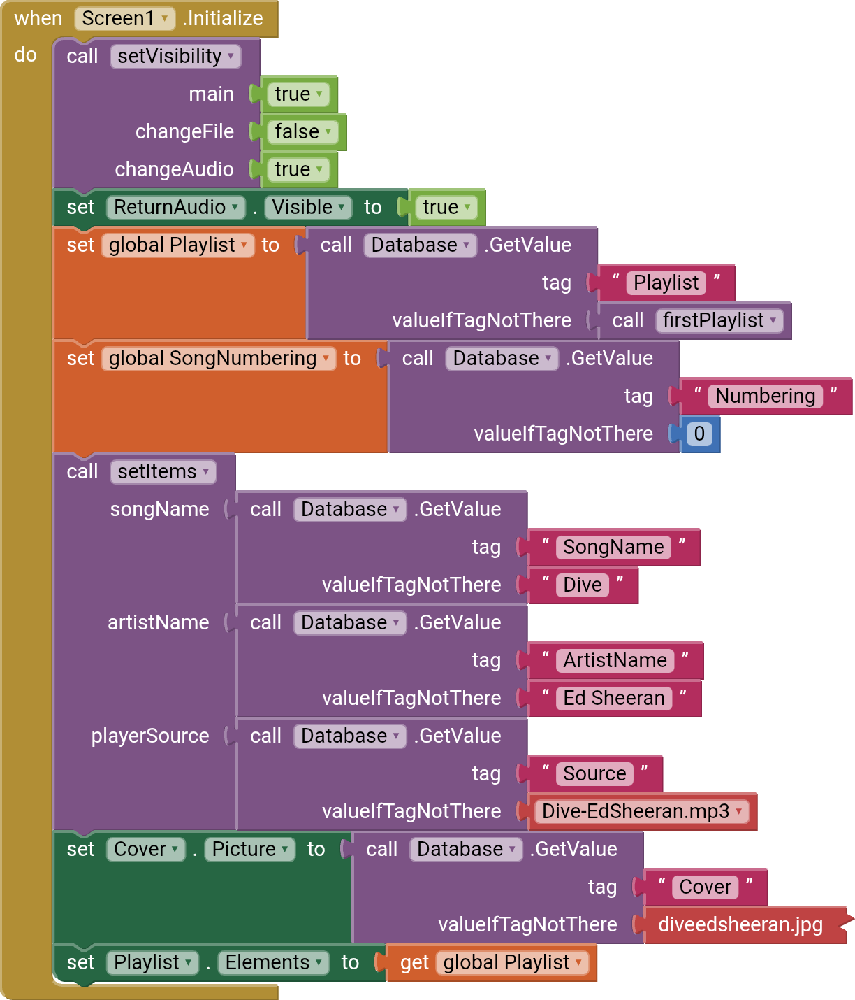
Ketika aplikasi dimuat, maka akan memanggil prosedur "setVisibility" dengan parameter:  
1. main = true (mengatur visibility dari MainScreen menjadi terlihat)  
2. changeFile = false (mengatur visibility dari ChangeFile menjadi tak terlihat)  
3. changeAudio = true (mengatur visibility dari ChangeAudio menjadi terlihat)  
serta visibility dari ReturnAudio menjadi terlihat.
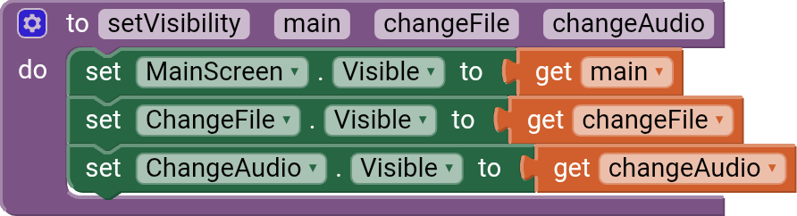
Bagian ini digunakan untuk menampilkan bagian pemutar audio.

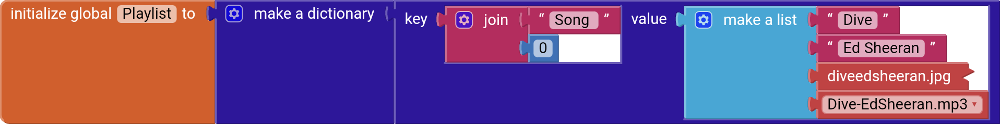
Variabel Playlist untuk apa? Variabel ini digunakan untuk menyimpan semua lagu yang ada, dengan nilai bawaan seperti gambar di atas. Bentuk dari nilai bawaan yang disimpan pada variabel Playlist adalah sebagai berikut.
```json
{
    "Song 0": {
        "Dive",
        "Ed Sheeran",
        "diveedsheeran.jpg",
        "Dive-EdSheeran.mp3"
    }
}
```
Lalu, mengatur variabel Playlist untuk menerapkan nilai dari database yang tersimpan dengan tag "Playlist." Kalau tag tidak memuat, maka gunakan nilai bawaan:
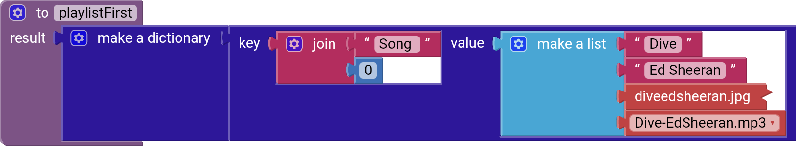  

Setelah mengambil nilai dari Playlist, kita akan mengambil nilai untuk SongNumbering dari database untuk diterapkan nilainya ke variabel SongNumbering. Kalau tidak memuat, maka gunakan nilai bawaan 0.


Setelahnya, kita akan memanggil prosedur "setItems" dengan parameter:
1. songName untuk mendapatkan nilai yang tersimpan di database dengan tag "SongName"
2. artistName untuk mendapatkan nilai yang tersimpan di database dengan tag "ArtistName"
3. playerSource untuk mendapatkan nilai yang tersimpan di database dengan tag "Source"
serta mengatur gambar dari "Cover" untuk mendapatkan nilai yang tersimpan di database dengan tag "Cover."
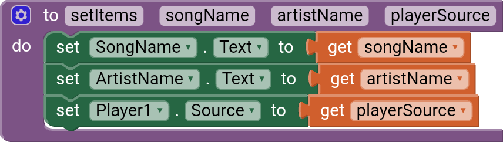

Yang terakhir, kita mengatur elemen-elemen dari Playlist agar nilainya bisa diambil dari variabel Playlist.

---

### Kontrol Audio

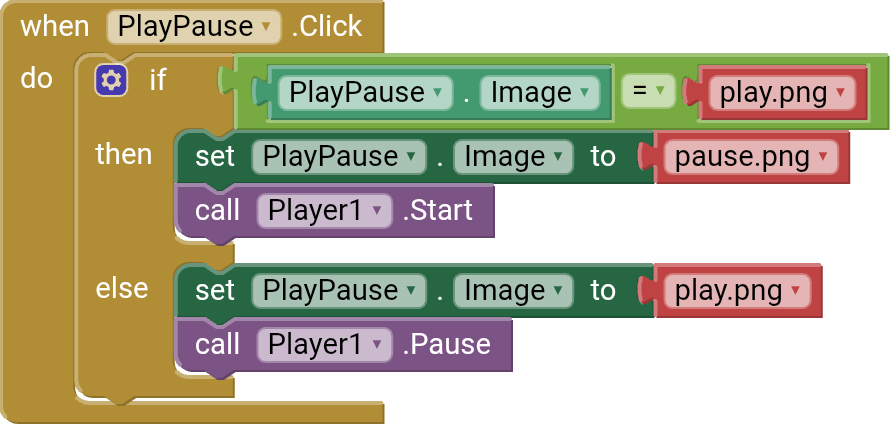
Kalau icon untuk tombol mulai dan berhenti ini adalah play.png (▶️), maka pada saat tombol ini diklik, nanti akan memutar lagu dan iconnya diubah menjadi pause.png (⏸️).  

Kalau semisal tombol ini dipencet lagi, nanti iconnya diubah menjadi play.png (▶️) dan menjeda lagunya.

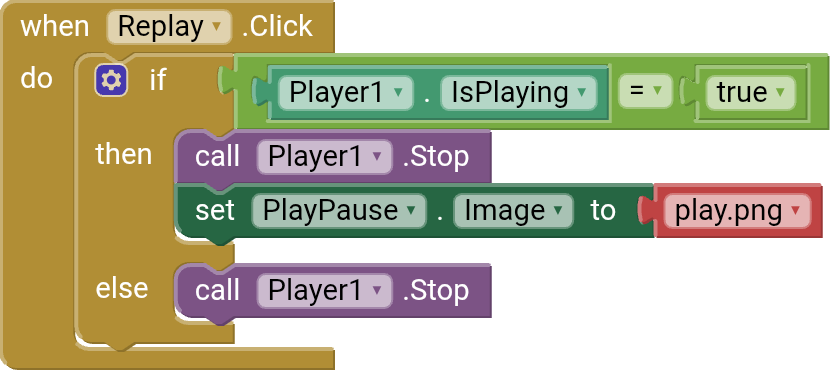
Kalau untuk blok Player1 ini sedang diputar, maka lagu yang sedang dimainkan Player1 akan berhenti dan memulai durasi audio dari awal, serta merubah icon mulai dan berhenti (PlayPause) menjadi play.png (▶️).  

Jika tidak, langsung memberhentikan lagu yang diputar Player1 dan memulai durasi audio dari awal.

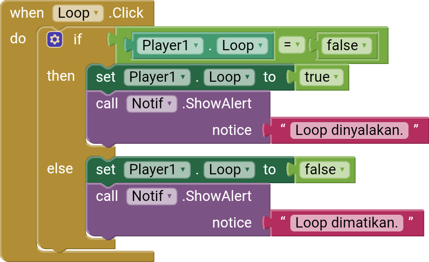
Kalau Player1 tidak berada dalam loop, maka pada saat tombol ini diklik, menyalakan loop untuk Player1 dan memberi peringatan:
> Loop dinyalakan.  

Jikalau loop dinyalakan untuk Player1, maka pada saat tombol ini dklik, akan mematikan loop untuk Player1 dan memberi peringatan:
> Loop dimatikan.

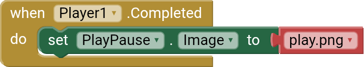
Pada saat Player1 sudah memainkan audionya sampai habis, secara otomatis akan merubah icon tombol PlayPause menjadi play.png (▶️).

---

### Penambahan Audio
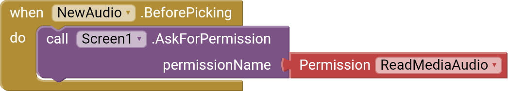
Pada saat tombol "Ganti file" ditekan, maka akan membuka tampilan pemilihan file. Namun sebelum itu, blok ini akan berjalan terlebih dahulu untuk meminta izin membaca Audio.

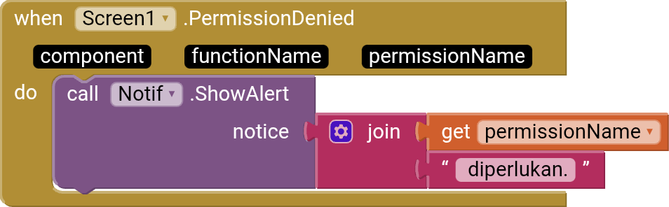
Jika permintaan untuk membaca Audio ini ditolak, maka hanya memunculkan peringatan:
> READ_MEDIA_AUDIO diperlukan.

Semisal masih ingin menjalankan lagunya tanpa izin membaca audio dinyalakan, maka audio yang diputar masih tetap Dive oleh Ed Sheeran.

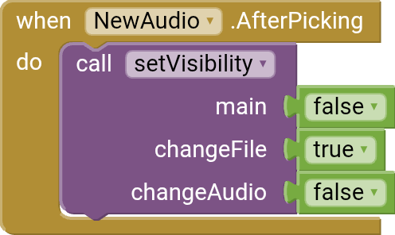
Setelah pengguna memilih file audio yang ingin diputar, akan memanggil prosedur "setVisibility" dengan parameter:  
1. main = false (mengatur visibility dari MainScreen menjadi tak terlihat)  
2. changeFile = true (mengatur visibility dari ChangeFile menjadi terlihat)  
3. changeAudio = false (mengatur visibility dari ChangeAudio menjadi tak terlihat)  

Bagian ini digunakan untuk menampilkan bagian menambah file audio.


Ketika pengguna sudah menekan tombol "Ganti" pada bagian tampilan menambah file audio, maka blok ini akan menutup keyboard agar keyboard tidak terbuka saat tampilan pemutar audio.

Setelahnya, ia akan memeriksa apakah input nama audio dan nama artist masih kosong. Kalau kosong, akan menampilkan peringatan:
> Wajib mengisi nama audio dan penyanyi!

Kalau tidak kosong, maka akan memulai proses penambahan audio ke playlist. Pertama, memanggil prosedur "setVisibility" dengan parameter:
1. main = true (mengatur visibility dari MainScreen menjadi terlihat)  
2. changeFile = false (mengatur visibility dari ChangeFile menjadi tak terlihat)  
3. changeAudio = true (mengatur visibility dari ChangeAudio menjadi terlihat)  

Bagian ini digunakan untuk menampilkan bagian pemutar audio.  

Kemudian, akan mengecek apakah pengguna tidak memilih cover. Kalau pengguna tidak memilih cover, maka gunakan file NotFound.png. Kalau pengguna memilih cover, maka atur sumber dari Cover dengan pilihan pengguna.

Lalu, memanggil prosedur setItems dengan parameter:
1. songName untuk mendapatkan teks pada InputAudioName yang telah dimasukkan pengguna.  
2. artistName untuk mendapatkan teks pada InputArtistName yang telah dimasukkan pengguna.  
3. playerSource untuk mendapatkan file audio yang telah dipilih pengguna.  


Setelahnya akan memulai proses pemanggilan database untuk menyetorkan nilai dari teks InputAudioName, InputArtistName, Cover, dan file Player1 dengan tag secara berurut: SongName, ArtistName, Cover, dan Source.

Untuk menyimpan playlist, aplikasi ini menyimpan audio dengan format: __Song (angka)__. Tidak menggunakan nama audio yang telah dimasukkan pengguna karena alasan teknis.

Maka dari itu, aplikasi ini menggunakan variabel SongNumbering dan ditambah satu seiring bertambahnya audio.

Kemudian, kita akan menyetorkan nilai dari input pengguna ke dalam variabel Playlist, dengan kunci:  
> Song (angka yang didapat dari variabel SongNumbering)

dan nilai yang disetorkan:
1. Teks dari SongName
2. Teks dari ArtistName
3. Sumber gambar dari Cover
4. Pilihan file audio dari pengguna.

Setelah menyetorkan nilai ke variabel Playlist, aplikasi ini akan menyimpan nilai yang ditetapkan oleh variabel Playlist dan SongNumbering ke database. Digunakan untuk menyimpan semua lagu yang telah ditambahkan pengguna dan mencegah penimpaan audio apabila pengguna me-restart aplikasi dan menambahkan file audio yang baru.

Lalu, memberi tahu pengguna bahwa audio sudah ditambahkan ke playlist.

Dan yang terakhir, aplikasi akan mengosongkan input dari InputAudioName dan InputArtistName agar pengguna saat memasuki tampilan penambahan audio, tidak menggunakan nama audio dan artist yang sama.

---

### Pemilihan Playlist
Ini adalah bagian yang terakhir, pemilihan playlist.

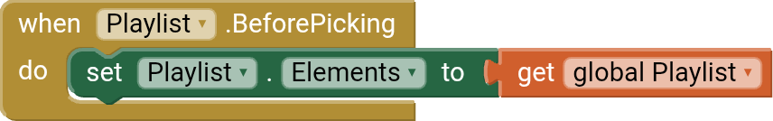
Sebelum aplikasi memuat tampilan pemilihan playlist, blok ini akan secara otomatis memuat ulang tampilan playlist agar semua playlist yang ditambahkan bisa terlihat. Jika blok ini tidak ada, maka playlist hanya menampilkan audio Dive oleh Ed Sheeran.

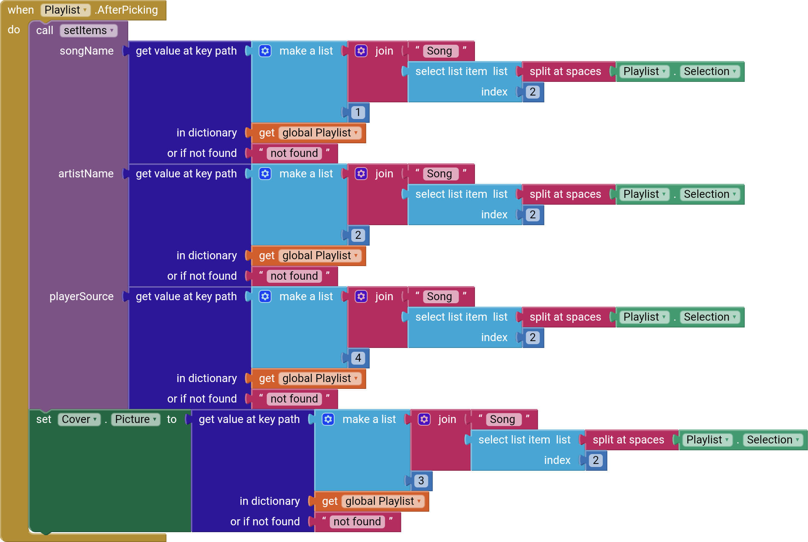
Setelah memuat ulang tampilan playlist, tentu pengguna akan memilih salah satu audio. Setelah salah satu audio dipilih, aplikasi akan memanggil prosedur setItems.

Untuk menerapkan data yang tersimpan pada salah satu audio playlist. Pasti ada yang bertanya, mengapa panjang sekali?

Jadi begini, kan untuk bentuk data yang tersimpan playlist adalah seperti ini:  
```json
{
    "Song 0": {
        "Dive",
        "Ed Sheeran",
        "diveedsheeran.jpg",
        "Dive-EdSheeran.mp3"
    }
}
```
Untuk mengambil data SongName berdasarkan data di atas, tidak bisa langsung mengambil data menggunakan blok seperti ini:
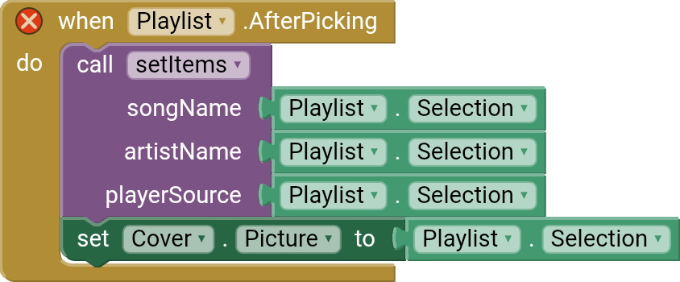
Karena format penamaan playlist menampilkan seperti ini:
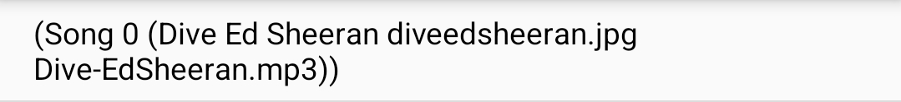
Aplikasi hanya dapat mengecek saja. Yang manakah judul audio, nama artist, gambar cover, maupun file audio, aplikasi ini tidak akan tahu. Jadi kita harus melalui proses pemisahan.

Tentu kita semua tahu kalau setiap Object atau Array memiliki index. Untuk MIT App Inventor, mereka menyimpan index pertama sebagai 1, bukan 0 seperti bahasa pemrograman biasanya.
```json
{
    "Song 0": {
        "Dive",                 << Index 1
        "Ed Sheeran",           << Index 2
        "diveedsheeran.jpg",    << Index 3
        "Dive-EdSheeran.mp3"    << Index 4
    }
}
```
Prosesnya dimulai di sini, kita akan mencari kunci yang manakah audio yang pengguna pilih, lalu memisahkannya menjadi dua item yang berpisah di antara spasi. Karena format penamaannya adalah "Song[spasi]0"
```json
    "Song"    << Index 1  
    "0"       << Index 2  
```

Kemudian kita mengambil index ke-2 ini.

Kita sudah mengakses audio yang pengguna pilih, kemudian untuk mencari yang manakah SongName, ArtistName, PlayerSource, dan Cover, kita akses index dalam object audio yang pengguna pilih.

1. Untuk songName, kita ambil index 1 lalu diatur ke songName  
2. Untuk artistName, kita ambil index 2 lalu diatur ke artistName  
3. Untuk playerSource, kita ambil index 4 lalu diatur ke playerSource  
4. Untuk Cover, kita ambil index 3 lalu diatur ke Cover.

Kalau dalam proses ini tidak menemukan data apapun, maka nanti untuk bagian SongName, ArtistName, playerSource, dan gambar Cover tersimpan sebagai "not found."